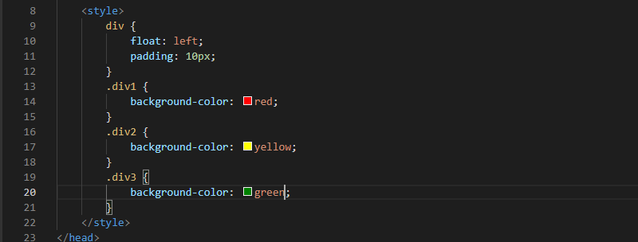
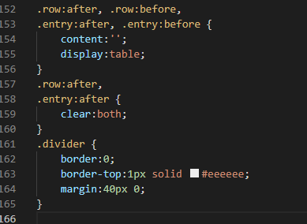

### Lab 4 Web
## Web Layout
# Membuat Box Element

Buat file dengan nama lab4_box.html, kemudian ketik struktur tag HTML berikut.

Kemudian tambahkan kode untuk membuat box element dengan tag div dab di bungkus dengan tag `<section>` seperti berikut.

Ini tampilannya di browser.

Kemudian tambahkan CSS pada kode tersebut.

Ini tampilannya di browser.

# Mengatur Clearfix Element

Clearfix digunakan untuk mengatur element setelah float element. Property clear digunakan untuk 
mengaturnya.
Tambahkan element div lainnya seteleah div3 seperti berikut.

Kemudian atur property clear pada CSS, seperti berikut

Ini tampilannya di browser.

Jika nilai property clear diganti dengan both, maka tampilannya akan sama dengan yang diatas. Kemudian Jika nilai property clear diganti dengan right, tampilannya akan seperti ini.

# Membuat Layout Sederhana

Pertama-tama yaitu buat folder baru dengan nama lab4_layout, kemudian buatlah file baru didalamnya dengan nama 
home.html, dan file css dengan nama style.css.

Pada file home.html ketikan tag HTML sebagai berikut.
Pada tag `<body>` tambahkan tag `
`dengan ID Container.

Kemudian tuliskan kode berikut.

Ini tampilannya di browser.

Setelah itu untuk mendeklarasikan CSS, tambahkan tag `<link>` pada tag `<head>`.

Kemudian tuliskan kode berikut pada file CSS. Dan tambahkan juga reset CSS agar mudah mengatur ukurannya, karena secara default tag-tag pada HTML sudah memiliki ukuran atau jarak.

Ini tampilannya di browser.

# Membuat Navigasi

Tambahkan kode berikut pada file CSS.

Ini tampilannya di browser.

# Membuat Hero Panel

Untuk menambahkan hero panel gunakan tag `<section>` dengan ID hero pada tag `
` dengan ID Container.

Tambahkan juga CSSnya.

Ini tampilannya di browser.

# Mengatur Layout Main dan Sidebar

Tambahkan CSS float.

Dan Tambahkan element lain dalam sidebar. 

Kemudian tambahkan CSS.

Ini tampilannya di browser.

# Mengatur Footer

Tambahkan CSS sebagai berikut.

Ini tampilannya di browser.

# Menambahkan Elemen lainnya pada Main Content

Tambahkan tag-tag HTML sebagai berikut.

Tambahkan juga CSS sebagai berikut.

Ini tampilannya di browser.

# Menambahkan Content Artikel

Tambahkan HTML sebagai berikut.

Tambahkan juga CSS sebagai berikut.

Ini tampilannya di browser.

## Pertanyaan dan Tugas
1. Tambahkan Layout untuk menu About

=> buat single layout yang berisi deskripsi, portfolio, dll

2. Tambahkan layout untuk menu Contact

=> yang berisi form isian: nama, email, message, dll

JAWAB :

1. Untuk menambahkan layout pada menu About yang berisi deskripsi dan portofolio, buat file HTML dengan nama about.html dan buat file CSS dengan nama styleAbout.css seperti berikut.

Kemudian isi file HTML tadi dengan kodingan ini.

Dan tambahkan CSS seperti dibawah ini.

Ini tampilannya di browser.

Ketika di klik pada menu About, akan muncul seperti diatas.

2. Untuk menambahkan layout pada menu Contact yang berisi form isian, buat file HTML dengan nama kontak.html dan buat file CSS dengan nama styleKontak.css seperti berikut.

Kemudian isi file HTML tadi dengan kodingan ini.

Dan tambahkan CSS seperti dibawah.

Kemudian ini tampilannya di browser.

